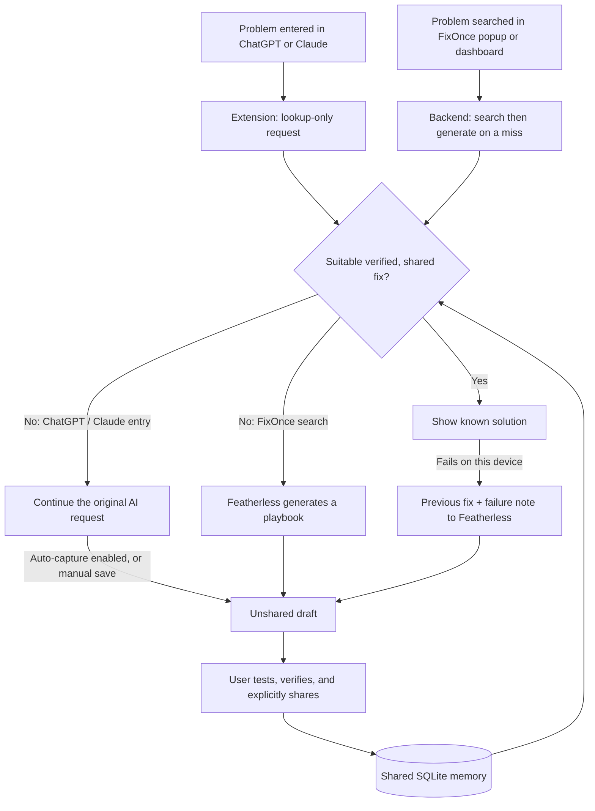

# FixOnce

> Solve once. Reuse everywhere.

FixOnce is a Chrome extension and shared solution library that brings previously tested fixes into ChatGPT and Claude before a user sends another troubleshooting question. When a suitable answer is missing—or a known fix fails on another laptop—Featherless AI can generate a structured recovery plan.

One person's tested solution becomes the next person's starting point, even when they describe the problem differently.

[Open the demo dashboard](https://fixonce.onrender.com/) · [Check API health](https://fixonce.onrender.com/api/health) · [Follow the demo](#demo-one-solution-two-laptops) · [Run locally](#run-locally)

## At a glance: the judging criteria

| Criterion | What FixOnce delivers | Evidence in this repository |
| --- | --- | --- |
| **Problem & Impact** | Reuses solutions that would otherwise stay buried in individual AI chats, reducing repeated troubleshooting and avoidable generation. | [Shared memory and reuse counters](app/db.py), [dashboard](frontend/app.js) |
| **AI Implementation** | Featherless generates actionable troubleshooting drafts and uses the previous fix plus a failure note to propose another path. Meaning-aware retrieval decides when an existing answer can be reused. | [Featherless integration](app/featherless.py), [retrieval](app/embeddings.py), [API decisions](app/main.py) |
| **Technical Execution** | A working extension, FastAPI backend, SQLite database, explicit verification/share transitions, and a Docker deployment. | [API](app/main.py), [storage](app/db.py), [Dockerfile](Dockerfile), [Render configuration](render.yaml) |
| **User Experience** | In-page solution cards, copy actions, scrollable answers, automatic reply capture with an on/off switch, and a guided alternative-fix form. | [ChatGPT/Claude integration](extension/content.js), [popup](extension/popup.js) |
| **Innovation & Creativity** | Connects the moment someone asks for help with community knowledge, then turns newly tested answers and failed attempts into reusable recovery paths. | [Capture, reuse, and alternative routes](app/main.py) |

## Problem & Impact: stop solving the same issue from scratch

A student fixes a package installation error. A teammate resolves a VPN problem. A developer repairs a broken deployment. Their answers often remain in separate chats, while the next person repeats the investigation.

FixOnce is designed for college labs, small IT teams, developer groups, and hackathon teams facing recurring technical problems.

Consider two requests:

```text
Laptop A: My office Wi-Fi says connected, but I cannot access the internet.
Laptop B: I am connected to the office network, but websites are not loading.
```

These describe similar symptoms. FixOnce searches for a previously tested solution and lets Laptop B try it immediately. If the cause differs on that device, the user can report the failure and request another path.

The intended impact is less repeated investigation, faster access to useful fixes, and fewer unnecessary model generations. Reuse counts and request timings make that behavior observable; this prototype does not claim measured dollar savings, energy savings, or organization-wide adoption.

## AI Implementation: Featherless powers new solutions and recovery

### Where Featherless is used

The backend calls `POST https://api.featherless.ai/v1/chat/completions` using a server-side API key. The default model in the code and deployment configuration is `Qwen/Qwen2.5-7B-Instruct`; both the model and API base URL are configurable.

Featherless serves two concrete roles:

1. **Solve a new problem.** Searching from the FixOnce popup or dashboard calls `/api/find-fix`. If community memory has no suitable match, the backend asks Featherless for a troubleshooting draft.
2. **Adapt after a failed fix.** `/api/knowledge/{id}/alternative` provides the user's problem, the previous solution, and what failed on their device. It requests a different recovery plan, stores the failure note, and creates a separate draft linked to the original solution.

The generation prompt requests these fields:

| Field | Purpose |
| --- | --- |
| `title` | Name the proposed fix. |
| `why` | Explain why the proposed action may help. |
| `steps` | Give 3–5 concrete actions to follow. |
| `verify` | Explain how the user can test the result. |
| `if_not_working` | Provide the next troubleshooting step. |

The backend formats valid structured responses into a readable playbook and accepts plain text when JSON parsing fails. The explanation and verification steps give users something they can inspect and test. Human confirmation is required before a generated draft can enter shared search.

**Verify actual Featherless use:** a successful generation response from the new-problem or alternative route reports `ai_called: true`, `fallback: false`, and the provider/model. A missing key or provider failure returns a category-based local fallback with `fallback: true`. That fallback is a demo continuity feature, not evidence of a successful model call. `featherless_configured: true` in the health endpoint confirms configuration only.

Implementation: [`generate_solution` and playbook formatting](app/featherless.py), [generation and alternative routes](app/main.py).

### How differently worded problems match

Retrieval runs locally **on the backend** and needs no model API call:

1. Normalize wording and expand domain synonyms.
2. Build a 384-dimensional vector from hashed words, character trigrams, and weighted issue concepts.
3. Add stronger signals for combined intents such as VPN + internal access or deployment + blank page.
4. Compare the query with verified, shared solutions using cosine similarity.
5. Return the highest-scoring solution if it meets `SIMILARITY_THRESHOLD`, which defaults to `0.64`.

For the two Wi-Fi questions above, the current implementation produces **0.894 similarity**. This is a retrieval score, not an 89.4% probability that the fix will work.

The MVP uses a deterministic, domain-focused feature encoder—not a pretrained neural embedding model. It supports paraphrases in its covered support domains; broader language understanding and multilingual retrieval are future work. Feedback changes stored confidence, while current search ranking uses cosine similarity.

Implementation: [`embed`, `cosine`, synonyms, and intent signatures](app/embeddings.py), [`find_match`](app/main.py).

## Technical Execution: a complete reuse loop



The two entry paths are intentional. Typing in ChatGPT or Claude uses `/api/search-memory`, which never generates an answer or creates a draft. A miss lets that AI conversation continue. Searching inside FixOnce uses `/api/find-fix`, which can call Featherless directly.

The extension's background service worker sends API requests to the configured backend. Both laptops use that same backend database; they do not need the same Wi-Fi network. Chrome storage holds settings and pending results, while reusable solutions live in SQLite.

Engineering decisions visible in the code:

- **Explicit publication gates:** community retrieval reads only rows where `verified = 1` and `shared = 1`; sharing an unverified draft returns HTTP 409.
- **Structured requests:** Pydantic validates fields and payload sizes; API errors are surfaced in the interfaces.
- **Storage evolution:** startup migrations preserve older database schemas, and stored embeddings are rebuilt at startup.
- **Latest-answer updates:** automatic capture updates an existing unverified, unshared draft for a conversation key. Already verified/shared solutions are not overwritten by that update.
- **Recovery records:** alternative drafts retain `related_knowledge_id`; failed attempts store a feedback note alongside the original fix.
- **Small deployment footprint:** FastAPI serves the dashboard and API in one container, with three direct Python dependencies and no frontend build step.

## User Experience: help inside the existing workflow

The beige interface uses sage, terracotta, and muted plum accents to distinguish known fixes, new suggestions, and recovery actions.

On supported ChatGPT and Claude pages, a matching solution appears in a scrollable card before sending. Users can select the answer, choose **Copy solution** or **Copy & use known fix**, request a Featherless alternative, or continue to the original AI chat.

The popup supports direct lookup, manual answer saving, verification, and explicit sharing. **Auto-save AI replies** is enabled when no preference has been saved and can be switched off. When enabled, the extension observes the latest visible assistant reply after a submitted prompt and sends debounced updates to an unshared draft. The popup can display those updates.

Automatic capture uses page DOM observation; a quiet interval is not a guarantee that generation has finished. Review the captured answer before verification. Manual paste-and-save remains available.

The dashboard provides a searchable community list, lookup results, reuse counters, latency comparisons, and a controlled simulation. Its **Delete all solutions** action requires typing `DELETE ALL`; it removes saved solutions and feedback while preserving query analytics.

## Innovation & Creativity: make troubleshooting knowledge accumulate

FixOnce combines three useful moments: finding a fix before asking again, capturing an answer after a conversation, and learning from a failed attempt on another device.

The reusable unit is a problem paired with a solution that someone has marked as working. A change in wording can still retrieve it. A failure can lead to a linked alternative without replacing the original answer. Each explicitly shared fix expands what the next user can discover.

Featherless therefore participates in the growth of community knowledge: it creates new candidates and adapts failed ones, while successful retrieval can avoid another generation.

## Demo: one solution, two laptops

Allow about 3–5 minutes, plus any host startup or generation time. Start with a fresh local demo database for a repeatable new-problem example, or check whether the hosted community already contains your example.

1. **Connect both laptops.** Load the extension and set the same backend URL in Extension options. Open the dashboard to confirm the API is reachable.
2. **Solve on Laptop A.** In the FixOnce popup or dashboard, search: `My office Wi-Fi says connected, but I cannot access the internet.` The starter database has no matching Wi-Fi fix, so this enters the new-problem path.
3. **Show Featherless's contribution.** Inspect the suggested playbook, explanation, and verification step. Confirm the response has `ai_called: true` and `fallback: false` using the browser Network panel or API docs.
4. **Test and share.** Test the suggestion, choose **Yes, it worked**, then **Share with community**. Before those actions, Laptop B's community search should not retrieve this draft.
5. **Reuse on Laptop B.** In the popup or dashboard, search: `I am connected to the office network, but websites are not loading.` Expect **KNOWN FIX FOUND**, the shared solution, and `ai_called: false`. Copy the answer.
6. **Show the in-page experience.** Type the same Laptop B question into ChatGPT or Claude. The extension should surface the known solution before sending.
7. **Show adaptation.** If the fix fails on Laptop B, choose **Ask Featherless for another fix** and describe the observed failure, for example: `DNS still times out after reconnecting on this Windows laptop.` Generate a linked alternative draft and review its test steps.

For a simulated failure, tell viewers it is a demo scenario. A user verification is a report that a fix worked on that device, not a universal correctness guarantee.

If the Wi-Fi fix is already shared, a known match is the expected result. **Reset demo** restores six starter examples and clears saved knowledge, feedback, and query history; use it only on a disposable demo instance.

To demonstrate capture separately, turn on **Auto-save AI replies**, submit an unmatched problem to ChatGPT or Claude, and inspect the resulting draft in the popup after the reply settles. Follow-up replies update the pending conversation draft while it remains unverified and unshared.

### Short presentation script

> “FixOnce helps a community stop repeating the same troubleshooting work. One person solves a problem and shares a tested fix. The next person can describe similar symptoms differently and retrieve that answer directly inside ChatGPT or Claude. When memory has no suitable fix, or an existing fix fails, Featherless generates a structured plan with steps and a way to test it. Each shared solution makes the community's memory more useful.”

## Evidence and how to evaluate it

The following checks were performed for this README update on September 5, 2026:

| Check | Observed result |
| --- | --- |
| Two Wi-Fi paraphrases above | Cosine similarity `0.894`, above the default `0.64` threshold. |
| Draft → verify → share → reuse | The draft was excluded from search until shared; premature sharing returned 409; a paraphrase then returned the same solution without another generation. |
| Failed-fix recovery | The generation function received the previous solution and failure note; the resulting draft remained unverified/unshared and linked to the original. |
| Latest-answer storage | Two auto-save requests with the same conversation key updated the same draft ID with the newest answer. |
| Hosted health endpoint | HTTP 200, `ok: true`, and `featherless_configured: true`. This does not establish live inference success. |

The workflow checks used an isolated temporary database and a mocked generation function. They validate backend transitions, not live Featherless output quality or browser DOM capture.

### Controlled simulation

**Run demo simulation** executes the same embedding and similarity functions over 36 predefined questions across six technical-support groups. At the default threshold, the local run produced:

| Simulated outcome | Count |
| --- | ---: |
| Questions | 36 |
| Requests requiring generation under an always-generate baseline | 36 |
| Retrieval misses with FixOnce | 7 |
| Questions resolved from simulated memory | 29 |
| Simulated reuse rate | 80.6% |

These are runtime results from a small, curated dataset. The simulation does not call Featherless, verify solution correctness, or measure production accuracy or actual inference savings. Reproduce it from the dashboard or by posting to `/api/demo/run`.

### Reading the dashboard accurately

Live counters come from [`Database.stats`](app/db.py). `ai_generations_avoided` counts logged known-fix responses, and `hit_rate` divides those responses by logged queries. Background lookup-only requests are excluded from these counters.

The six starter fixes contain seeded verification/reuse counts; the monthly trend illustration and its percentage are presentation examples. They are not adoption evidence. The current `featherless_calls` aggregate includes new-result fallback events, so use individual response flags to distinguish live generation from fallback. Reuse counts record returned solutions; helpful feedback is a separate signal.

## Run locally

Prerequisites: Python 3.12 or newer, Chrome for the extension, and a Featherless API key for live generation.

From the repository root, create an environment and install the backend:

```powershell
py -3 -m venv .venv
.\.venv\Scripts\python.exe -m pip install -r requirements.txt
```

Create or edit a local `.env` file with your own values:

```dotenv
FEATHERLESS_API_KEY=your-featherless-key
FEATHERLESS_MODEL=Qwen/Qwen2.5-7B-Instruct
FEATHERLESS_BASE_URL=https://api.featherless.ai/v1
SIMILARITY_THRESHOLD=0.64
DATABASE_PATH=./data/fixonce.db
ALLOWED_ORIGINS=*
```

Keep the key in the backend environment; `.env` is ignored by Git. Start the app:

```powershell
.\.venv\Scripts\python.exe -m uvicorn app.main:app --reload --port 8000
```

Open [the local dashboard](http://localhost:8000), [interactive API docs](http://localhost:8000/docs), or [health status](http://localhost:8000/api/health).

For an isolated demo, set `DATABASE_PATH` to an unused file such as `./data/judging-demo.db` before starting. An empty database receives the six starter examples.

Alternatively, after configuring `.env`, run:

```sh
docker compose up --build
```

The [Compose configuration](docker-compose.yml) mounts a named volume for local SQLite storage.

### Install the extension on each laptop

1. Open `chrome://extensions` and enable **Developer mode**.
2. Choose **Load unpacked** and select this repository's [`extension` folder](extension).
3. Open FixOnce's **Extension options** and save your backend URL: `http://localhost:8000` for a server on that laptop, or the same deployed HTTPS URL on both laptops.
4. Refresh existing ChatGPT/Claude tabs and check the **Auto-save AI replies** switch.

The shared demo URL is `https://fixonce.onrender.com`. The extension's configurable default is localhost, so set the deployed URL explicitly on each laptop. Installing the extension alone does not start a local backend.

After extension updates, reload FixOnce at `chrome://extensions` and refresh the supported chat tabs. Deploying Render updates the dashboard/backend; it does not replace the unpacked extension files on either laptop.

### Render deployment

[render.yaml](render.yaml) configures one Docker web service on the free plan with `/api/health` as its health check. Deploy this repository as a Render Blueprint and provide `FEATHERLESS_API_KEY` as a service secret.

Free Render services can sleep when idle and lose local SQLite changes on restart, redeploy, or spin-down. Allow startup time before the demo. Durable hosted storage needs a persistent disk on an eligible service or a database migration; this repository currently uses SQLite. See [Render's free-service documentation](https://render.com/docs/free).

## API and source map

| Purpose | Endpoint | Implementation |
| --- | --- | --- |
| Search only; no generation | `POST /api/search-memory` | [app/main.py](app/main.py) |
| Search, then generate on a miss | `POST /api/find-fix` | [app/main.py](app/main.py), [app/featherless.py](app/featherless.py) |
| Save a pasted answer / update captured reply | `POST /api/knowledge/save`, `POST /api/knowledge/auto-save` | [app/main.py](app/main.py), [app/db.py](app/db.py) |
| Generate a linked alternative | `POST /api/knowledge/{id}/alternative` | [app/featherless.py](app/featherless.py), [app/db.py](app/db.py) |
| Verify / share / give feedback | `POST /api/knowledge/{id}/verify`, `/share`, `/feedback` | [app/main.py](app/main.py) |
| Shared solutions / counters / health | `GET /api/knowledge`, `GET /api/stats`, `GET /api/health` | [app/main.py](app/main.py) |
| Clear solutions / reset demo / simulate | `DELETE /api/knowledge`, `POST /api/demo/reset`, `POST /api/demo/run` | [app/main.py](app/main.py) |

The browser integration is in [extension/content.js](extension/content.js), API messaging in [extension/background.js](extension/background.js), and popup actions in [extension/popup.js](extension/popup.js). The dashboard lives in [frontend](frontend). Retrieval is in [app/embeddings.py](app/embeddings.py), storage in [app/db.py](app/db.py), and reuse classification in [app/safety.py](app/safety.py).

## Prototype scope and next steps

This is a hackathon MVP with working backend workflows and a browser integration that depends on supported sites' page markup. ChatGPT/Claude UI changes can affect capture and prompt detection. Retrieval is a linear scan over domain-focused vectors, suitable for a small demo library rather than a demonstrated large-scale index.

“Private draft” currently means excluded from shared search; the API does not implement authenticated ownership or workspace isolation. The rule-based classifier screens some sensitive/time-dependent problem text on lookup and auto-capture, but it is not comprehensive answer redaction or a universal publication filter.

The next priorities are authenticated workspaces and durable hosted storage, a broader retrieval evaluation set with neural embeddings, and a Featherless reviewer that checks drafts for missing steps before human verification. Those are planned improvements, not current features. Nearby-IP storage clustering remains a commented design example and is not part of the running application.
